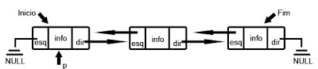

### **Resumo**

O projeto trata-se de um sistema para gerenciamento de aluguéis de carros, fazendo o uso dos assuntos respectivos às três unidades ministradas, em sala de aula.

### **Descrição**

O sistema de gerenciamento conta com três TADs e um módulo. Sendo estas para o carro, aluguel e cliente, e no módulo estão contidos as funções gerais. 

O sistema foi criado para ser capaz de adicionar um cliente ou veículo, alugar e fazer a verificação dos veículos disponíveis, ou seja, contará com a listagem dos carros, bem como dos clientes. Além disso, permitirá a busca dentro dos dados existentes, permitindo a edição, mas este último apenas no menu Cliente. Entre outras funções dispostas em ambos os menus, como consultar, remover e exibir histórico. 

Além disso, o projeto faz uso de listas duplamente encadeadas, que permitem a possibilidade de percorrer a lista nos dois sentidos, tanto do início para o fim, como do fim para o início. 

### **Vantagens**

As maiores vantagens apresentadas pelo uso de Listas duplamente encadeadas é:

- Possibilidade de percorrer a lista em qualquer direção;

<p align="center">
 
</p>

- Flexibilidade;

### **Desvantagens**

As maiores desvantagens apresentadas pelo seu uso é:

- Consome mais memória;

- Complexidade de implementação;

### **Funções Importantes** 

### Função cliente_cadastra

- **Descrição:** Cria um novo cadastro de cliente.

```c
Cliente *cliente_cadastra(int tag, Cliente *cli, char *nome, char *doc, char *tel);
```

### Função cliente_exclui

- **Descrição:** Exclui o cadastro do cliente.

```c
Cliente *cliente_exclui(Cliente *cli, char *dado);
```

### Função carro_lista

- **Descrição:** Lista os carros.

```c
Carro *carro_lista(Carro *carro);
```

### Função cliente_busca

- **Descrição:** Busca os clientes.

```c
Cliente *cliente_busca(Cliente *cli, char* dado_busca);
```

### Função cliente_edita

- **Descrição:** Abre a sessão de edição, para modificar.

```c
void cliente_edita(Cliente *cli);
```

### Função carro_disponivel

- **Descrição:** Consulta os carros disponíveis.

```c
void carro_disponivel(Carro *carro);
```

### Função cliente_total 

- **Descrição:** Calcula o total de clientes cadastrados.

```c
int cliente_total(Cliente *cli);
```

### **Funções Extras** 

