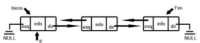

### **Resumo**

O projeto trata-se de um sistema para gerenciamento de aluguéis de carros, fazendo o uso dos assuntos respectivos às três unidades ministradas, em sala de aula.

### **Descrição**

O sistema de gerenciamento conta com três TADs e um módulo. Sendo estas para o carro, aluguel e cliente, e no módulo estão contidos as funções gerais. 

O sistema foi criado para ser capaz de adicionar um cliente ou veículo, alugar e fazer a verificação dos veículos disponíveis, ou seja, contará com a listagem dos carros, bem como dos clientes. Além disso, permitirá a busca dentro dos dados existentes, permitindo a edição, mas este último apenas no menu Cliente. Entre outras funções dispostas em ambos os menus, como consultar, remover e exibir histórico. 

Além disso, o projeto faz uso de listas duplamente encadeadas, que permitem a possibilidade de percorrer a lista nos dois sentidos, tanto do início para o fim, como do fim para o início. 

### **Vantagens**

As maiores vantagens apresentadas pelo uso de Listas duplamente encadeadas é:

- Possibilidade de percorrer a lista em qualquer direção;

<p align="center">
 
</p>

- Flexibilidade.

### **Desvantagens**

As maiores desvantagens apresentadas pelo seu uso é:

- Consome mais memória;

- Complexidade de implementação;


### **Funções em Cliente** 

### Função cliente_cadastra

- **Descrição:** Cria um novo cadastro de cliente.

```c
Cliente *cliente_cadastra(int tag, Cliente *cli, char *nome, char *doc, char *tel);
```

### Função cliente_libera

- **Descrição:** Libera memória alocada para a lista de clientes.

```c
void cliente_libera(Cliente *cli);
```

### Função cliente_exclui

- **Descrição:** Exclui o cadastro do cliente.

```c
Cliente *cliente_exclui(Cliente *cli, char *dado);
```

### Função cliente_consulta

- **Descrição:** Verifica os detalhes de registro do cliente.

```c
int cliente_consulta(Cliente *cli, Cliente *consultado);
```
### Função cliente_aluga

- **Descrição:** Inicia o processo de aluguel de carro.

```c
void cliente_aluga(Cliente *cli, char *doc, Carro* carro, char *data_hoje);
```

### Função cliente_lista

- **Descrição:** Imprime a lista dos clientes cadastrados.

```c
Cliente *cliente_lista(Cliente *cli);
```

### Função cliente_busca_filtro

- **Descrição:** A partir de um dado de busca, retorna lista de elementos que o contenham parcialmente ou por completo.

```c
Cliente *cliente_filtra_busca(Cliente *cli, char* dado_busca);
```

### Função cliente_ordena

- **Descrição:** Retorna a posição ordenada de um novo cliente,
    na ordem alfabética.

```c
Cliente *cliente_ordena(Cliente *cli, char *nome);
```

### Função cliente_edita

- **Descrição:** Abre a sessão de edição, para modificar.

```c
void cliente_edita(Cliente *cli);
```

### Função cliente_total 

- **Descrição:** Calcula o total de clientes cadastrados.

```c
int cliente_total(Cliente *cli);
```

### Função cliente_cria_historico

- **Descrição:** Cria um arquivo de histórico para o cliente.

```c
void cliente_cria_historico(Cliente *cli, char *doc);
```

### Função cliente_atualiza_historico

- **Descrição:**  Atualiza as informações do cliente no histórico.

```c
void cliente_atualiza_historico(int tag, Cliente *cli);
```

### Função cliente_recupera_historico

- **Descrição:** Recarrega a lista de clientes no início da execução do programa.

```c
Cliente *cliente_recupera_historico(Cliente *cli, Carro *carro, char *doc);
```

### Função cliente_apaga_historico

- **Descrição:** Apaga histórico de um cliente (que foi removido da lista de cadastrados).

```c
void cliente_apaga_historico(Cliente *cli);
```


### **Funções em Carro** 

### Função carro_cadastra

- **Descrição:** Cadastra um novo carro no sistema, adicionando suas características.

```c
Carro *carro_cadastra(Carro *carro, char *modelo, char *placa, float preco, int disponibilidade);
```

### Função carro_libera

- **Descrição:** Libera a mémoria que foi alocada para os carros.

```c
void carro_libera(Carro *carro);
```

### Função carro_lista

- **Descrição:** Lista os carros.

```c
Carro *carro_lista(Carro *carro);
```

### Função carro_ordena

- **Descrição:** Ordena os carros em ordem alfabética.

```c
Carro *carro_ordena(Carro *carro, char *modelo);
```

### Função carro_leia

- **Descrição:** Função que lê os dados dos carros que estão em um arquivo .txt e os aloca na struct.

```c
Carro *carro_leia(Carro *carro);
```

### Função carro_edita

- **Descrição:** Possibilita a edição do preço dos carros.

```c
void carro_edita(Carro  *carro, Carro *carro_consultado);
```

### Função carro_exclui

- **Descrição:** Retira o carro do sistema e libera o espaço da mémoria onde ele estava alocado.

```c
void carro_exclui(Carro *carro, Carro *carro_consultado);
```

### Função carro_consulta

- **Descrição:** Abre um menu exclusivo para um carro específico que foi selecionado pelo usuário. 

```c
int carro_consulta(Carro *carro, Carro *carro_consultado);
```

### Função carro_disponivel

- **Descrição:** Consulta os carros disponíveis.

```c
void carro_disponivel(Carro *carro);
```

### Função carro_busca

- **Descrição:** Busca um carro em específico pela placa ou modelo, usando tipo = 0 para buscar pelo modelo e tipo = 1 para buscar pela placa.

```c
Carro *carro_busca(Carro *carro, char *modelo, int tipo);
```

### Função carro_atualiza_galeria

- **Descrição:** Função que atualiza a galeria (arquivo .txt onde está os dados dos carros) após alguma mudança durante a execução do programa.

```c
void carro_atualiza_galeria(Carro *carro);
```


### **Funções em Aluguel** 

### Função aluguel_cria

- **Descrição:** Cria um novo elemento na lista de aluguel, inserindo-o de forma ordenada.

```c
Aluguel *aluguel_cria(Aluguel* aluguel, Carro* carro, char *data, int duracao, int status);
```

### Função aluguel_libera

- **Descrição:** Libera a memória alocada para a lista de aluguel.

```c
void aluguel_libera(Aluguel *aluguel);
```

### Função aluguel_ordena

- **Descrição:** Retorna a posição ordenada do novo aluguel, na ordem cronológica.

```c
Aluguel *aluguel_ordena(Aluguel *aluguel, char *data_inicio);
```


### **Funções Gerais** 

### Função delay

- **Descrição:** Gera um atraso, em milissegundos, na resposta do programa.

```c
void delay(double milissegundos);
```

### Função clear

- **Descrição:** Limpa o terminal de acordo com o SO do usuário.

```c
char *clear(void);
```

### Funções dos menus

- **Descrição:** Exibição dos menus principal, cliente e carro.

```c
int menu_principal(Cliente *cli);
```

```c
Cliente *menu_cliente(Cliente *cli, Carro *carro);
```

```c
Carro *menu_carro(Cliente *cli, Carro *carro);
```

### Funções do registro 

- **Descrição:** Armazena um resumo dos dados para recuperar histórico na re-execução do código.

```c
void registro(Cliente *cli);
```

```c
void registro_leia(Cliente **cli, Carro **carro);
```